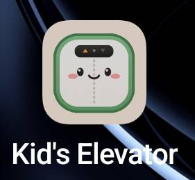
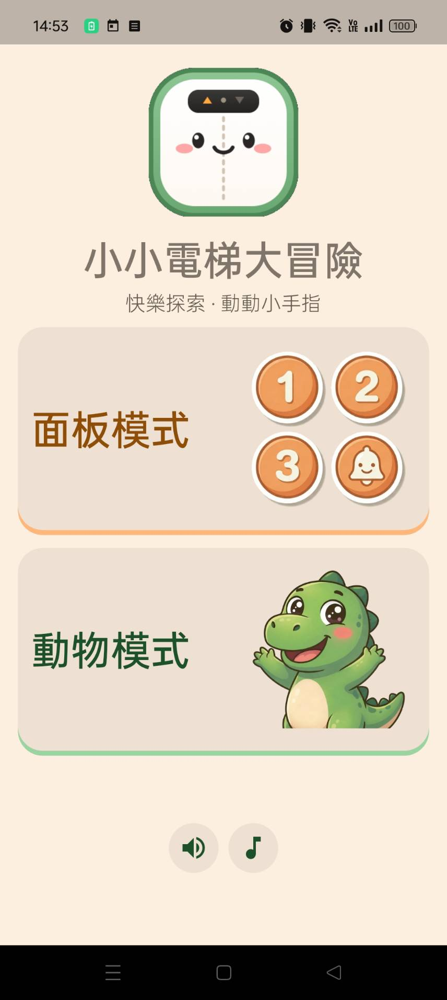
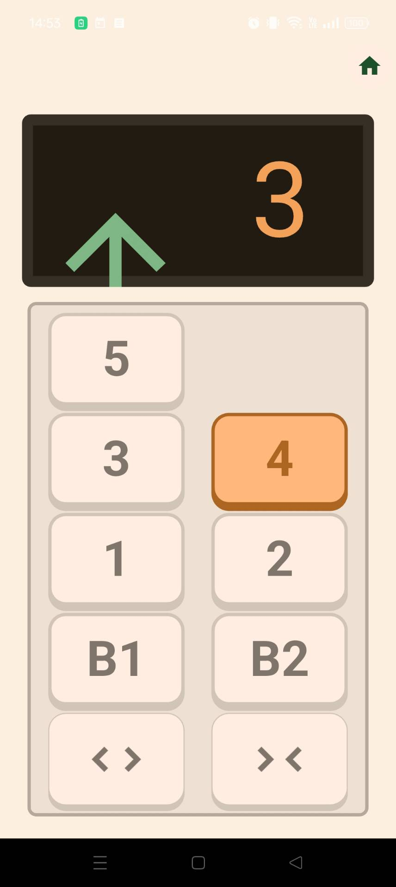
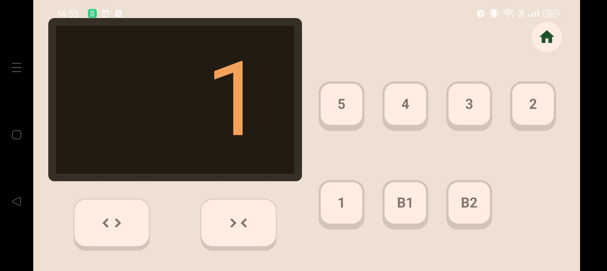
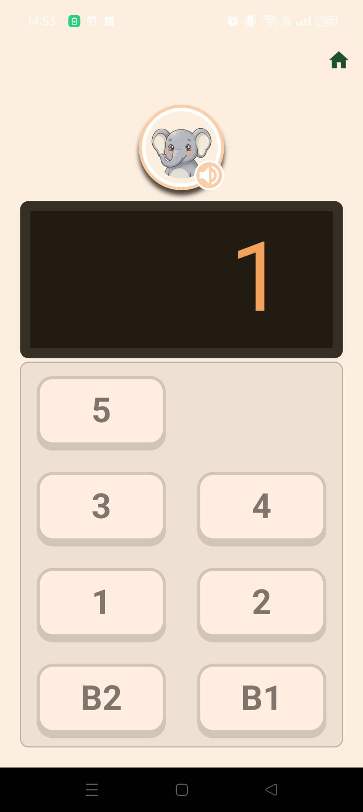
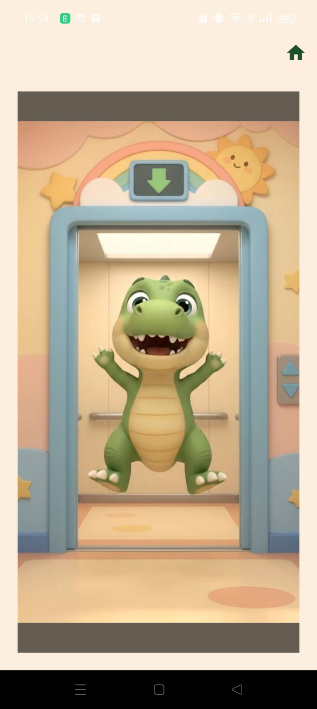

# 小小電梯大冒險（Kid's Elevator）

<p align="center"></p>

一款給 2～5 歲小孩練習「樓層數字認知」的電梯情境 Android App，以 Flutter 開發。畫面模擬搭電梯時看到的操作面板：小孩可以自由按樓層、聽語音播報，也可以在動物模式裡聽題目、找出對的樓層。

> 這是我學習 Flutter 的練習專案。我原本的背景是 JavaScript／Node.js，開始前沒有寫過 Flutter、Dart，也沒有寫過任何自動化測試。整個專案從需求與設計文件開始，分成 26 個階段逐步完成功能與測試。

> **關於 AI 的使用**：學習過程中，我把 Claude 當作家教：講解觀念、用提問引導我思考、review 我寫的程式碼，但不直接提供解答。`lib/` 與 `test/` 的程式內容，是我在理解語法及原理後自行撰寫的；設計文件、學習紀錄與這份 README，則是與 Claude 討論後整理而成。各階段的學習紀錄保留在 [`docs/claudeChat/`](docs/claudeChat/)。

---

## 功能

App 完全在裝置上執行，不需要網路、帳號，也不記錄任何使用者資料。

### 主選單

- 選擇進入「面板模式」或「動物模式」
- 兩個各自獨立的開關：按鈕提示音效、語音播報（同時控制兩個模式）

### 面板模式：自由操作、熟悉樓層

- 7 個樓層（B2、B1、1～5），點擊選擇目標樓層，再按一次取消
- 電梯依序停靠：移動一層 2 秒，抵達後播放「叮」聲與樓層語音，自動開門，5 秒後自動關門
- 可以操作開門／關門；長按開門可以延長開門時間
- 樓層顯示區用方向箭頭的滑動動畫呈現上樓、下樓、開門、關門
- 支援直式與橫式兩種版面，依裝置方向自動切換

### 動物模式：語音出題、找出樓層

- 隨機出題：語音播報「想去幾樓」（一定跟目前樓層不同），題目由隨機的動物提出
- 每次只能選一個樓層，選定後不能取消
- 抵達後判斷答案：答對播放動物慶祝的動畫並出下一題；答錯播放動物哭喪臉的動畫，可以再試一次
- 可以重播題目語音

---

## 截圖

### 主選單與面板模式

<table>
  <tr>
    <td align="center"><br>主選單</td>
    <td align="center"><br>面板模式・直式（往 4 樓移動中）</td>
  </tr>
  <tr>
    <td align="center" colspan="2"><br>面板模式・橫式</td>
  </tr>
</table>

### 動物模式

<table>
  <tr>
    <td align="center"><br>出題中</td>
    <td align="center"><br>回答正確：動物開心慶祝</td>
    <td align="center"><br>回答錯誤：動物哭喪臉</td>
  </tr>
</table>

---

## 技術重點

| 項目 | 做法 |
|---|---|
| 狀態管理 | 畫面內的電梯狀態機用 `StatefulWidget`；跨畫面共用的音效／語音開關用 **Riverpod**（`NotifierProvider`） |
| 音訊 | **audioplayers**：語音播報有播放佇列與「播完才執行」的 callback，確保「語音播完才開門」；按鈕音效是另外一個播放器，設定 `mixWithOthers` 避免搶音訊焦點 |
| 影片 | **video_player** 播放動物模式的答對／答錯動畫，用 `Stack` 疊層顯示（不用 `Dialog`，避免被系統返回鍵關閉） |
| 動畫 | `AnimationController` + `SlideTransition` 做方向箭頭的滑動動畫 |
| 響應式版面 | `MediaQuery` 判斷方向，`LayoutBuilder` 依實際可用的寬高計算按鈕尺寸 |
| 計時 | `TimerManager` 集中管理所有計時器，同一時間只保留一個，避免舊計時器在背景覆蓋新狀態 |
| 可測試性 | 播放器抽出介面（`abstract class` + `implements`），畫面透過建構子注入，測試時可以換成替身 |

動物模式的答對／答錯動畫影片以 Google Flow 生成，提示詞保留在 [`docs/googleFlow/`](docs/googleFlow/)。

---

## 測試

共 70 個測試，`flutter analyze` 無警告，行覆蓋率約 66%。

| 類型 | 做法 | 例子 |
|---|---|---|
| Unit test | 純資料與邏輯 | `Floor` 資料正確性、`TimerManager` |
| Widget test | `pumpWidget`／`tap`／`find.byKey` 操作元件並驗證畫面 | 樓層按鈕、開關門按鈕、主選單、面板模式 |
| 依賴注入 | 用 `FakeSfxPlayer`／`FakeVoicePlayer` 取代真正的播放器；用 `ProviderScope.overrides` 替換 Riverpod 狀態 | 面板模式的點擊與移動流程 |
| 虛擬時間 | widget test 用 `pump(Duration)`、unit test 用 `fakeAsync` 推進假時鐘，不用真的等待 | 電梯跨樓層移動、計時器（16 秒 → 不到 1 秒，精確到 1 毫秒） |
| Mock platform channel | 攔截 audioplayers 與 `path_provider` 送往原生端的訊息，讓真正的 `SfxPlayer` 能在測試中執行，並驗證它送出的內容 | `SfxPlayer` |

撰寫時遵守的原則：預期值要有獨立的來源（不拿實作的常數來驗證實作）、計時要檢查邊界兩側（差 1 毫秒未觸發、補 1 毫秒已觸發）、驗證「沒發生」的測試一定要做反向驗證。

還沒有測試覆蓋的部分（動物模式畫面、`VoicePlayer`、長按開門的計時分支等）列在 [`docs/todo/測試待辦清單.md`](docs/todo/測試待辦清單.md)。

---

## Repo 結構

```
elevator/
├── app/                    Flutter 專案（執行與測試方式見 app/README.md）
│   ├── lib/
│   │   ├── main.dart       App 進入點
│   │   ├── constants/      樓層定義（Floor enum）
│   │   ├── interfaces/     播放器介面（SfxPlayerBase／VoicePlayerBase）
│   │   ├── models/         電梯狀態、計時器、音效／語音播放器等純資料與邏輯
│   │   ├── providers/      Riverpod 共用狀態（音效／語音開關）
│   │   ├── screens/        主選單、面板模式、動物模式
│   │   ├── styles/         顏色、文字大小、間距
│   │   └── widgets/        可重用的顯示元件
│   └── test/               路徑與 lib/ 對應；另有 fakes/（替身）、mocks/（模擬原生端）
└── docs/
    ├── design/             設計文件
    ├── todo/               待辦清單
    ├── claudeChat/         各階段的學習紀錄與學習路徑
    ├── googleFlow/         動畫影片的生成提示詞
    └── assets/             README 用的截圖
```

---

## 文件

| 文件 | 內容 |
|---|---|
| [設計主軸](docs/design/設計主軸.md) | App 目的、功能需求、UI 元件、不做的事項 |
| [資料結構](docs/design/資料結構.md) | `models/`、`styles/`、`constants/`、`interfaces/` 的欄位與設計考量 |
| [畫面結構](docs/design/畫面結構.md) | `screens/` 的畫面組裝、業務邏輯與設計考量 |
| [元件結構](docs/design/元件結構.md) | `widgets/` 的可重用元件與設計考量 |
| [狀態管理結構](docs/design/狀態管理結構.md) | `providers/` 的 Riverpod 共用狀態 |
| [測試結構](docs/design/測試結構.md) | `test/` 的組織方式、替身與模擬、撰寫測試的注意事項 |
| [學習路徑總覽](docs/claudeChat/學習路徑總覽.md) | 26 個階段的主題與決策記錄 |

---

## 使用的套件

- [flutter_riverpod](https://pub.dev/packages/flutter_riverpod)：狀態管理
- [audioplayers](https://pub.dev/packages/audioplayers)：語音與音效播放
- [video_player](https://pub.dev/packages/video_player)：動畫影片播放
- [fake_async](https://pub.dev/packages/fake_async)（測試）：虛擬時間
- [flutter_launcher_icons](https://pub.dev/packages/flutter_launcher_icons)（開發）：產生 App 圖示
